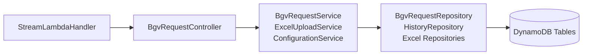
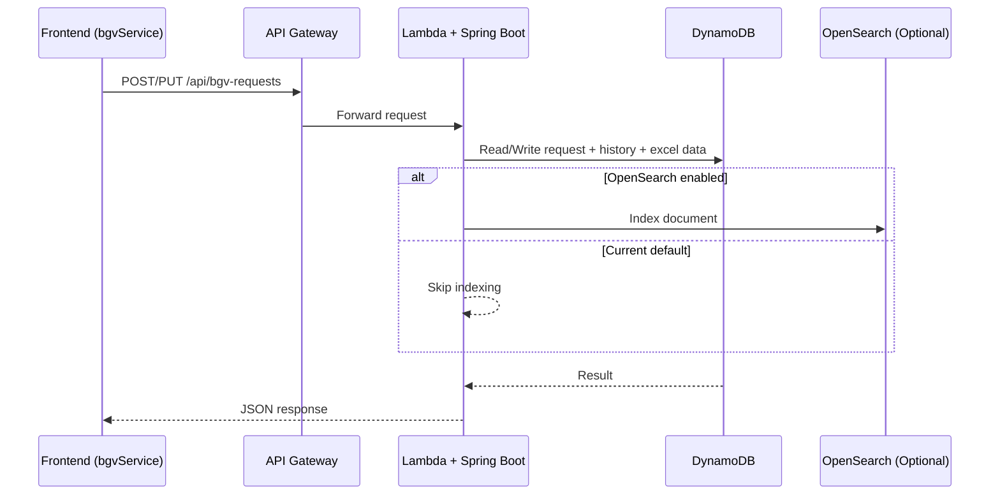

# Architecture

## Quick summary

The BGV application runs as a serverless web system on AWS:

1. Users access the React frontend through CloudFront.
2. Frontend calls backend APIs through API Gateway.
3. API Gateway invokes one Java Lambda running Spring Boot.
4. Spring services read/write BGV data in DynamoDB.
5. SharePoint is optional for evidence flow, and OpenSearch is currently disabled.

---

## 1) Proper architecture diagram

```mermaid
flowchart TB
        U[Users\nPM / Admin / Super Admin]

        subgraph EDGE[Frontend Delivery]
            CF[CloudFront]
            S3[S3 Static Website Bucket\nVite Build Artifacts]
        end

        subgraph API[API Layer]
            AGW[Amazon API Gateway\n/api proxy]
        end

        subgraph COMPUTE[Backend Compute]
            LMB[Lambda Java 21\nStreamLambdaHandler]
            APP[Spring Boot Application\nController -> Service -> Repository]
        end

        subgraph DATA[Data Layer]
            D1[(bgv-requests-<stage>)]
            D2[(bgv-request-history-<stage>)]
            D3[(bgv-excel-upload-records-<stage>)]
            D4[(bgv-excel-upload-cells-<stage>)]
        end

        subgraph INTEGRATION[External Integrations]
            SP[SharePoint / Graph API\nOptional]
            OS[OpenSearch\nOptional - Disabled]
        end

        subgraph OPS[Observability]
            CW[CloudWatch Logs / Alarms / Dashboard]
            SNS[SNS Email Alerts\nOptional]
        end

        U --> CF
        CF --> S3
        U --> AGW
        AGW --> LMB --> APP
        APP --> D1
        APP --> D2
        APP --> D3
        APP --> D4
        APP -.enabled when configured.-> SP
        APP -.opensearch.enabled=true only.-> OS
        AGW --> CW
        LMB --> CW
        CW --> SNS
```

---

## 2) Backend component flow



---

## 3) Request lifecycle (create/update)



---

## 4) AWS resources used now

- API: API Gateway + one Java Lambda (`bgv-api-<stage>`)
- Data: 4 DynamoDB tables
  - `bgv-requests-<stage>`
  - `bgv-request-history-<stage>`
  - `bgv-excel-upload-records-<stage>`
  - `bgv-excel-upload-cells-<stage>`
- Frontend hosting: S3 + CloudFront
- Monitoring: CloudWatch alarms/dashboard (+ optional SNS email topic)

## 5) Important notes

- `dev` stack is currently instantiated in CDK app
- `prod` stack definition exists but is commented in CDK bootstrap file
- In production mode, CDK enforces Cognito authorizer configuration for API methods
- Frontend routes using `VITE_API_BASE`
- OpenSearch code exists but runtime default is disabled (`opensearch.enabled=false`)

---

## 6) Source references

- Backend boot and CORS: `src/main/java/com/bgv/application/BgvApplication.java`
- API controller: `src/main/java/com/bgv/application/controller/BgvRequestController.java`
- Core business service: `src/main/java/com/bgv/application/service/BgvRequestService.java`
- Lambda bridge handler: `src/main/java/com/bgv/application/lambda/StreamLambdaHandler.java`
- DynamoDB repository pattern: `src/main/java/com/bgv/application/repository/BgvRequestRepository.java`
- Optional OpenSearch service: `src/main/java/com/bgv/application/service/OpenSearchService.java`
- Runtime properties: `src/main/resources/application.properties`
- Frontend API integration: `../frontend/src/services/bgvService.js`
- CDK stack: `../infrastructure/cdk/lib/bgv-serverless-stack.ts`
- CDK app bootstrap: `../infrastructure/cdk/bin/app.ts`
- OpenSearch init script (stub): `../../scripts/initialize-opensearch-indices.cmd`

---

## 7) Complete BGV System Architecture Diagram

```mermaid
graph TB
    %% User Layer
    PM[PM User]
    ADMIN[Admin User]
    SUPERADMIN[Super Admin User]
    
    %% Frontend Layer
    subgraph Frontend["Frontend Layer - React Application"]
        REACT[React SPA<br/>Vite Build]
        ROUTER[React Router]
        COMPONENTS[Components:<br/>PmForm, AdminForm,<br/>SuperAdmin, History,<br/>PmDashboard, YearlyDashboard]
        BGVSERVICE[bgvService.js<br/>Axios API Client]
    end
    
    %% CDN and Static Hosting
    subgraph CDN["Content Delivery"]
        CLOUDFRONT[Amazon CloudFront<br/>Global CDN]
        S3BUCKET[S3 Static Website Bucket<br/>HTML, CSS, JS Assets]
    end
    
    %% API Gateway Layer
    subgraph APIGATEWAY["API Gateway Layer"]
        APIGW[Amazon API Gateway<br/>REST API<br/>/api/* Proxy]
        CORS[CORS Configuration<br/>Authorization: Optional Cognito]
    end
    
    %% Compute Layer
    subgraph BACKEND["Backend Compute - AWS Lambda"]
        LAMBDA[Lambda Function<br/>Java 21 ARM64<br/>SnapStart Enabled<br/>1536MB Memory]
        
        subgraph SPRING["Spring Boot Application"]
            HANDLER[StreamLambdaHandler<br/>AWS Serverless Container]
            SPRINGBOOT[BgvApplication<br/>Spring Boot 3.x]
            
            subgraph CONTROLLERS["Controller Layer"]
                BGVCONTROLLER[BgvRequestController<br/>REST Endpoints]
            end
            
            subgraph SERVICES["Service Layer"]
                BGVSERVICE_BACKEND[BgvRequestService<br/>Business Logic]
                EXCELSERVICE[ExcelUploadService<br/>Excel Processing]
                CONFIGSERVICE[ConfigurationService<br/>App Config]
                SHAREPOINTSERVICE[SharePointUploadService<br/>Optional Integration]
                OPENSEARCHSERVICE[OpenSearchService<br/>Conditional Bean<br/>Currently Disabled]
            end
            
            subgraph REPOSITORIES["Repository Layer"]
                BGVREPO[BgvRequestRepository<br/>DynamoDB Enhanced Client]
                HISTORYREPO[BgvRequestHistoryRepository<br/>DynamoDB Enhanced Client]
                EXCELRECORDREPO[BgvExcelUploadRecordRepository]
                EXCELCELLREPO[BgvExcelUploadCellRepository]
            end
            
            subgraph DOMAIN["Domain Layer"]
                ENTITY[BgvRequest Entity]
                HISTORYENTITY[BgvRequestHistory Entity]
                DTO[BgvRequestDTO]
            end
        end
    end
    
    %% Database Layer
    subgraph DATABASE["Data Layer - Amazon DynamoDB"]
        TABLE1[bgv-requests-dev<br/>PK: id<br/>GSI: psNumber, status,<br/>resourcePsNo, candidateId,<br/>userRole-status]
        TABLE2[bgv-request-history-dev<br/>PK: historyId<br/>GSI: psNumber, resourcePsNo,<br/>candidateId, bgvRequestId]
        TABLE3[bgv-excel-upload-records-dev<br/>PK: id<br/>GSI: uploadBatchId]
        TABLE4[bgv-excel-upload-cells-dev<br/>PK: id<br/>GSI: uploadBatchId]
    end
    
    %% External Integrations
    subgraph EXTERNAL["External Integrations"]
        SHAREPOINT[SharePoint / Graph API<br/>Evidence Upload<br/>Optional - Configurable]
        OPENSEARCH[Amazon OpenSearch<br/>Advanced Search<br/>Optional - Currently Disabled]
    end
    
    %% Monitoring and Operations
    subgraph MONITORING["Observability & Operations"]
        CLOUDWATCH[CloudWatch Logs<br/>Lambda Logs<br/>API Gateway Logs]
        ALARMS[CloudWatch Alarms<br/>5xx Errors<br/>Lambda Errors/Throttles<br/>Duration P95]
        DASHBOARD[CloudWatch Dashboard<br/>Metrics & KPIs]
        SNS[SNS Topic<br/>Email Alerts<br/>Optional]
    end
    
    %% User to Frontend
    PM --> REACT
    ADMIN --> REACT
    SUPERADMIN --> REACT
    
    %% Frontend Internal Flow
    REACT --> ROUTER
    ROUTER --> COMPONENTS
    COMPONENTS --> BGVSERVICE
    
    %% Frontend to CDN
    BGVSERVICE --> CLOUDFRONT
    CLOUDFRONT --> S3BUCKET
    
    %% Frontend to API
    BGVSERVICE -->|HTTP/HTTPS<br/>REST Calls| APIGW
    
    %% API Gateway Flow
    APIGW --> CORS
    CORS --> LAMBDA
    
    %% Lambda Internal Flow
    LAMBDA --> HANDLER
    HANDLER --> SPRINGBOOT
    SPRINGBOOT --> BGVCONTROLLER
    BGVCONTROLLER --> BGVSERVICE_BACKEND
    BGVCONTROLLER --> EXCELSERVICE
    BGVCONTROLLER --> CONFIGSERVICE
    
    %% Service to Repository
    BGVSERVICE_BACKEND --> BGVREPO
    BGVSERVICE_BACKEND --> HISTORYREPO
    BGVSERVICE_BACKEND --> SHAREPOINTSERVICE
    BGVSERVICE_BACKEND --> OPENSEARCHSERVICE
    EXCELSERVICE --> EXCELRECORDREPO
    EXCELSERVICE --> EXCELCELLREPO
    
    %% Repository to Domain
    BGVREPO -.uses.- ENTITY
    HISTORYREPO -.uses.- HISTORYENTITY
    BGVCONTROLLER -.uses.- DTO
    
    %% Repository to Database
    BGVREPO --> TABLE1
    HISTORYREPO --> TABLE2
    EXCELRECORDREPO --> TABLE3
    EXCELCELLREPO --> TABLE4
    
    %% External Integrations
    SHAREPOINTSERVICE -.optional.- SHAREPOINT
    OPENSEARCHSERVICE -.disabled.- OPENSEARCH
    
    %% Monitoring
    LAMBDA --> CLOUDWATCH
    APIGW --> CLOUDWATCH
    CLOUDWATCH --> ALARMS
    CLOUDWATCH --> DASHBOARD
    ALARMS --> SNS
    
    %% Styling
    classDef frontend fill:#e1f5ff,stroke:#01579b,stroke-width:2px
    classDef backend fill:#fff3e0,stroke:#e65100,stroke-width:2px
    classDef database fill:#f3e5f5,stroke:#4a148c,stroke-width:2px
    classDef external fill:#e8f5e9,stroke:#1b5e20,stroke-width:2px
    classDef monitoring fill:#fce4ec,stroke:#880e4f,stroke-width:2px
    
    class REACT,ROUTER,COMPONENTS,BGVSERVICE,CLOUDFRONT,S3BUCKET frontend
    class LAMBDA,HANDLER,SPRINGBOOT,BGVCONTROLLER,BGVSERVICE_BACKEND,EXCELSERVICE,CONFIGSERVICE,SHAREPOINTSERVICE,OPENSEARCHSERVICE,BGVREPO,HISTORYREPO,EXCELRECORDREPO,EXCELCELLREPO backend
    class TABLE1,TABLE2,TABLE3,TABLE4 database
    class SHAREPOINT,OPENSEARCH external
    class CLOUDWATCH,ALARMS,DASHBOARD,SNS monitoring
```



### Architecture Components Summary

**Frontend Tier:**
- React SPA built with Vite, hosted on S3, delivered via CloudFront
- Components for different user roles (PM, Admin, Super Admin)
- Axios-based API service for backend communication

**API Tier:**
- Amazon API Gateway with REST API endpoints
- Proxy integration to Lambda
- Optional Cognito authorization (production mode)

**Compute Tier:**
- AWS Lambda (Java 21 ARM64, SnapStart enabled)
- Spring Boot 3.x application
- Layered architecture: Controller → Service → Repository → Domain

**Data Tier:**
- 4 DynamoDB tables with GSI indexes for efficient querying
- Pay-per-request billing mode
- Point-in-time recovery enabled in production

**External Integrations:**
- SharePoint/Graph API: Optional evidence upload (configurable)
- OpenSearch: Optional advanced search (currently disabled)

**Operations Tier:**
- CloudWatch for logging, metrics, and alarms
- SNS for email alerting (optional)
- Dashboard for monitoring KPIs

---

## 8) Simple Architecture Flow Diagram

```
┌─────────────────────────────────────────────────────────────────────────────┐
│                              USERS (PM/Admin/Super Admin)                    │
└──────────────────────────────────┬──────────────────────────────────────────┘
                                   │
                                   ▼
┌─────────────────────────────────────────────────────────────────────────────┐
│                           FRONTEND (React + Vite)                            │
│  ┌──────────────┐  ┌──────────────┐  ┌──────────────┐  ┌──────────────┐   │
│  │   PmForm     │  │  AdminForm   │  │ SuperAdmin   │  │   History    │   │
│  └──────────────┘  └──────────────┘  └──────────────┘  └──────────────┘   │
│                                                                               │
│                         bgvService.js (Axios)                                │
└──────────────────────────────────┬──────────────────────────────────────────┘
                                   │ HTTP/REST
                                   ▼
┌─────────────────────────────────────────────────────────────────────────────┐
│                    CLOUDFRONT + S3 (Static Hosting)                          │
└──────────────────────────────────┬──────────────────────────────────────────┘
                                   │
                                   ▼
┌─────────────────────────────────────────────────────────────────────────────┐
│                          API GATEWAY (/api/*)                                │
│                    (Optional Cognito Authorization)                          │
└──────────────────────────────────┬──────────────────────────────────────────┘
                                   │
                                   ▼
┌─────────────────────────────────────────────────────────────────────────────┐
│                    AWS LAMBDA (Java 21, SnapStart)                           │
│  ┌───────────────────────────────────────────────────────────────────────┐  │
│  │                   StreamLambdaHandler                                  │  │
│  └───────────────────────────────┬───────────────────────────────────────┘  │
│                                  │                                           │
│  ┌───────────────────────────────▼───────────────────────────────────────┐  │
│  │                   SPRING BOOT APPLICATION                              │  │
│  │  ┌───────────────────────────────────────────────────────────────┐    │  │
│  │  │  CONTROLLER LAYER                                              │    │  │
│  │  │  - BgvRequestController (REST endpoints)                       │    │  │
│  │  └───────────────────────────┬───────────────────────────────────┘    │  │
│  │                              │                                         │  │
│  │  ┌───────────────────────────▼───────────────────────────────────┐    │  │
│  │  │  SERVICE LAYER                                                 │    │  │
│  │  │  - BgvRequestService (Business Logic)                          │    │  │
│  │  │  - ExcelUploadService (Excel Processing)                       │    │  │
│  │  │  - ConfigurationService (App Config)                           │    │  │
│  │  │  - SharePointUploadService (Optional)                          │    │  │
│  │  │  - OpenSearchService (Optional - Disabled)                     │    │  │
│  │  └───────────────────────────┬───────────────────────────────────┘    │  │
│  │                              │                                         │  │
│  │  ┌───────────────────────────▼───────────────────────────────────┐    │  │
│  │  │  REPOSITORY LAYER                                              │    │  │
│  │  │  - BgvRequestRepository (DynamoDB Enhanced Client)             │    │  │
│  │  │  - BgvRequestHistoryRepository                                 │    │  │
│  │  │  - BgvExcelUploadRecordRepository                              │    │  │
│  │  │  - BgvExcelUploadCellRepository                                │    │  │
│  │  └───────────────────────────┬───────────────────────────────────┘    │  │
│  └──────────────────────────────┼────────────────────────────────────────┘  │
└───────────────────────────────────┼────────────────────────────────────────┘
                                   │
                                   ▼
┌─────────────────────────────────────────────────────────────────────────────┐
│                          DYNAMODB TABLES                                     │
│  ┌────────────────────┐  ┌────────────────────┐  ┌────────────────────┐    │
│  │ bgv-requests-dev   │  │ bgv-request-       │  │ bgv-excel-upload-  │    │
│  │                    │  │ history-dev        │  │ records-dev        │    │
│  │ GSI: psNumber,     │  │                    │  │                    │    │
│  │ status, candidateId│  │ GSI: psNumber,     │  │ GSI: uploadBatchId │    │
│  │ resourcePsNo       │  │ bgvRequestId       │  │                    │    │
│  └────────────────────┘  └────────────────────┘  └────────────────────┘    │
│                                                   ┌────────────────────┐    │
│                                                   │ bgv-excel-upload-  │    │
│                                                   │ cells-dev          │    │
│                                                   │ GSI: uploadBatchId │    │
│                                                   └────────────────────┘    │
└─────────────────────────────────────────────────────────────────────────────┘

                       ┌──────────────────────────────┐
                       │  OPTIONAL INTEGRATIONS       │
                       │  - SharePoint (Disabled)     │
                       │  - OpenSearch (Disabled)     │
                       └──────────────────────────────┘

┌─────────────────────────────────────────────────────────────────────────────┐
│                    MONITORING & OPERATIONS                                   │
│  ┌────────────────┐  ┌────────────────┐  ┌────────────────┐                │
│  │  CloudWatch    │  │  CloudWatch    │  │  SNS Email     │                │
│  │  Logs          │→ │  Alarms        │→ │  Alerts        │                │
│  └────────────────┘  └────────────────┘  └────────────────┘                │
└─────────────────────────────────────────────────────────────────────────────┘
```

### Data Flow Summary:
1. **User** → Accesses React Frontend
2. **Frontend** → Calls API via bgvService.js (Axios)
3. **CloudFront/S3** → Serves static assets
4. **API Gateway** → Routes `/api/*` to Lambda
5. **Lambda** → Runs StreamLambdaHandler → Spring Boot App
6. **Spring Controllers** → Receive HTTP requests
7. **Spring Services** → Execute business logic
8. **Spring Repositories** → Query DynamoDB using Enhanced Client
9. **DynamoDB** → Stores/retrieves BGV data
10. **CloudWatch** → Logs activity and triggers alarms
11. **SNS** → Sends email alerts (optional)
