# BGV Request Management System

Background verification (BGV) request tracking application for PM, PMO Admin, and Super Admin roles.

## Stack

| Layer | Technology |
|-------|------------|
| Backend | Java 21, Spring Boot 3.1, Spring Security, JWT, JPA, Flyway |
| Database | H2 file (`backend/data/bgverificationdb`) in PostgreSQL mode |
| Frontend | React 18, Vite, Axios, hash-based routing |

## Application Preview

### Login Screen

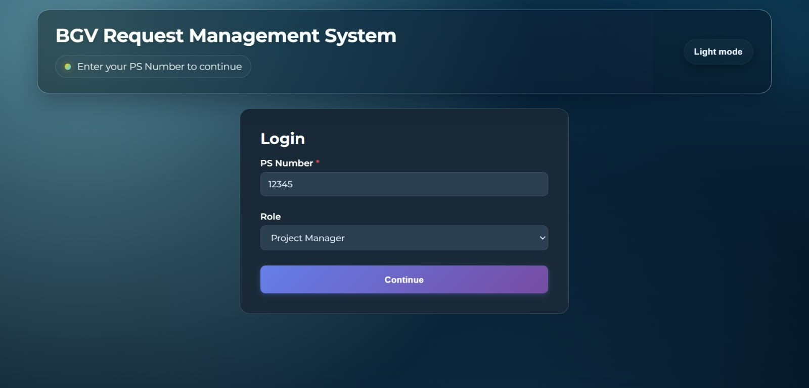

### Dashboard

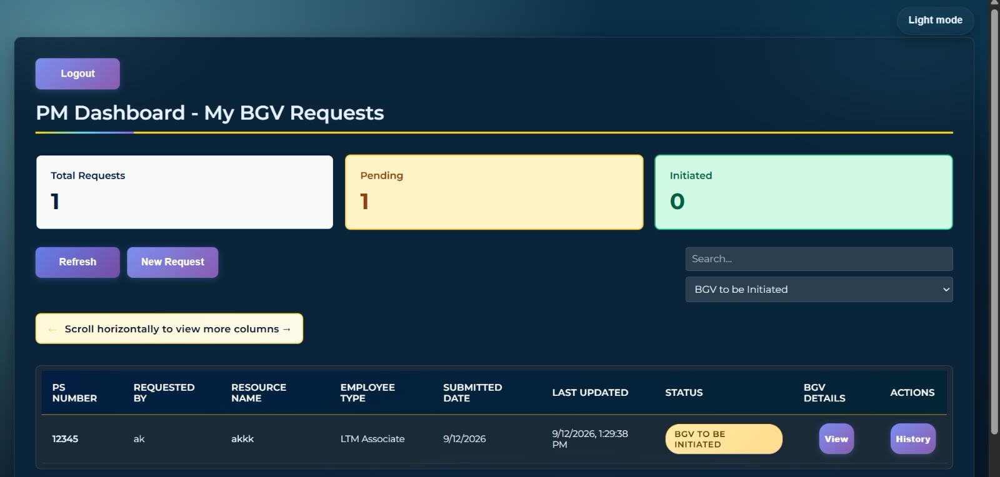

### Request Management

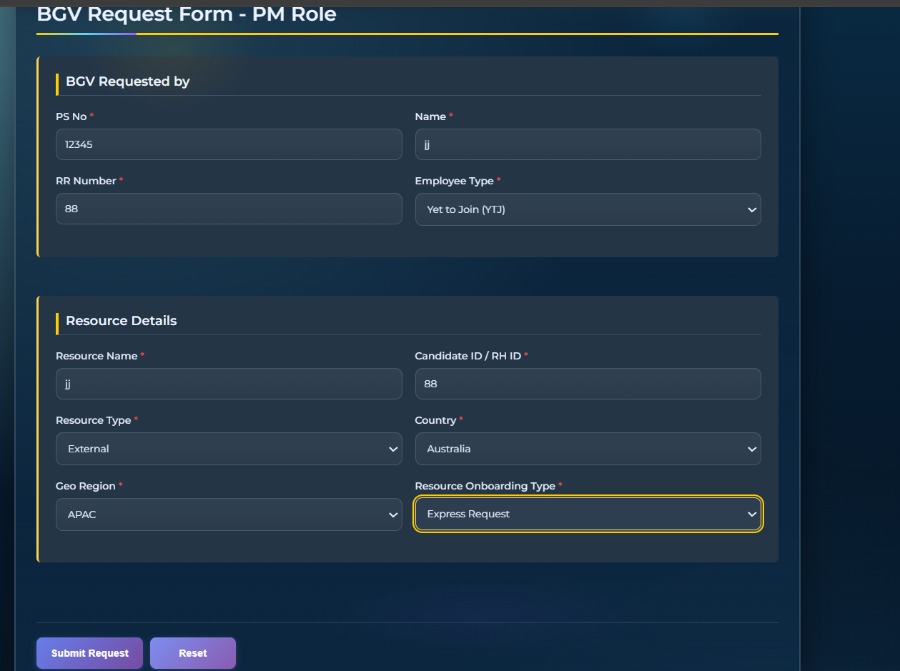

### Application Screens

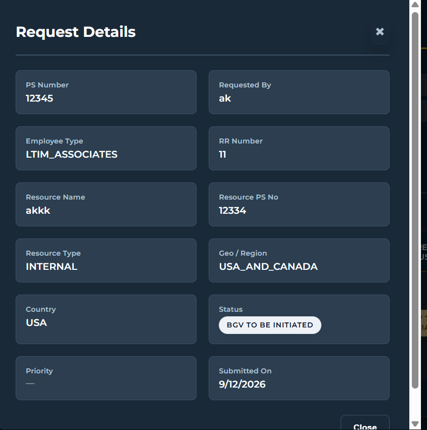

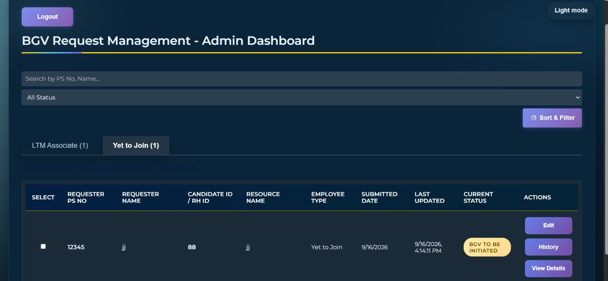

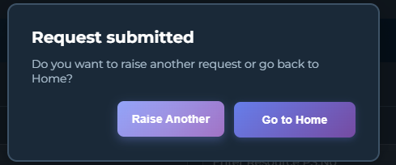

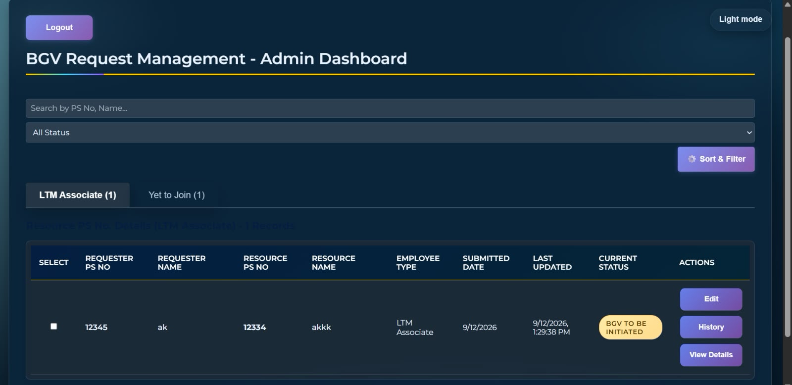

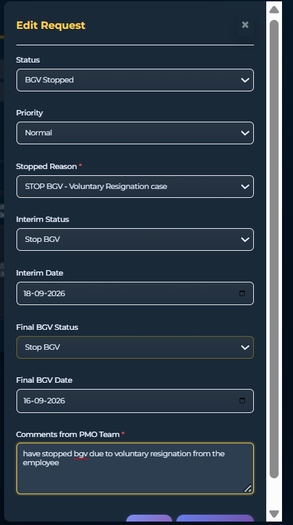

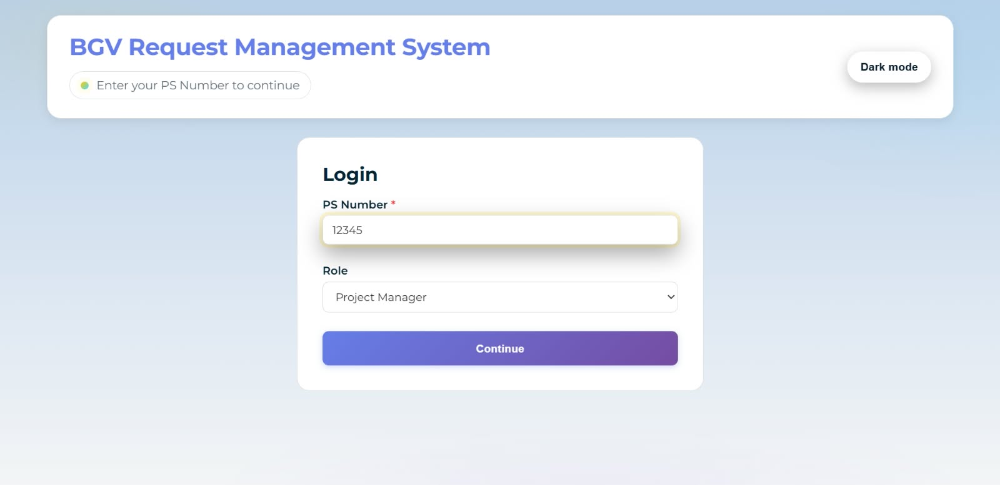

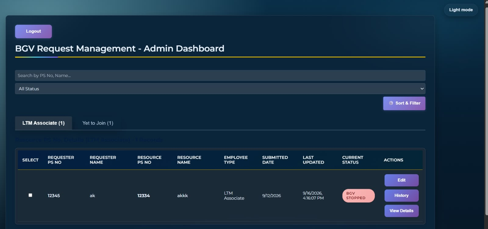


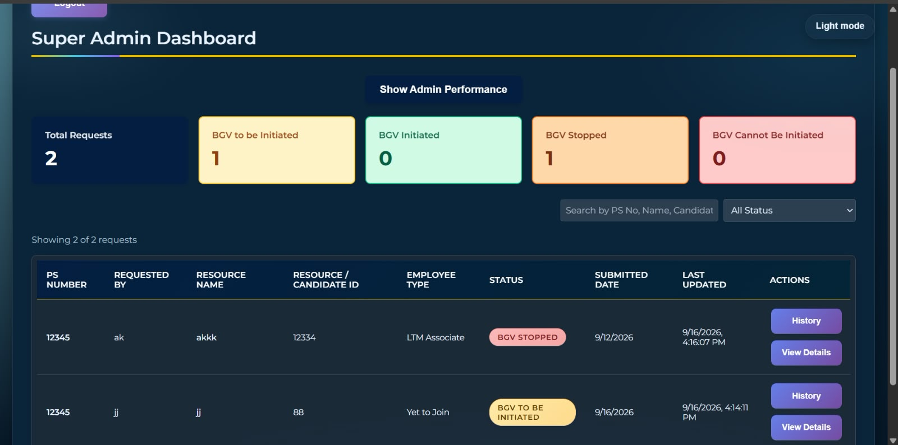


## Run Locally

### Backend

```bash
cd backend
mvn spring-boot:run
```

Or use `dev-run.ps1`, which stops any old instance running on port `8080` first.

- API: http://localhost:8080
- H2 Console: http://localhost:8080/h2-console
- JDBC URL: `jdbc:h2:file:./data/bgverificationdb`
- Username: `sa`
- Password: Leave empty

### Frontend

```bash
cd frontend
npm install
npm run dev
```

Application: http://localhost:5173

## Login

1. Enter PS Number.
2. Select a role:
   - PM
   - PMO Admin
   - Super Admin
3. Continue — JWT is obtained automatically in the background.

### Demo Accounts

Demo accounts are seeded on the first run:

| Account | Password |
|---------|----------|
| `hr@demo.com` | `Password123!` |
| `admin@demo.com` | `Password123!` |

## Project Layout

```text
BGV_Final_v24.0/
├── backend/       Spring Boot API
├── frontend/      React UI
├── images/        Application screenshots
├── .gitignore
└── README.md
```
